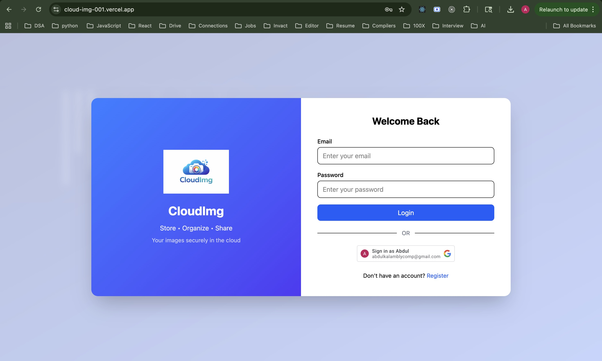
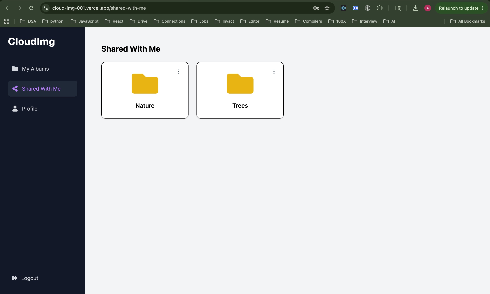
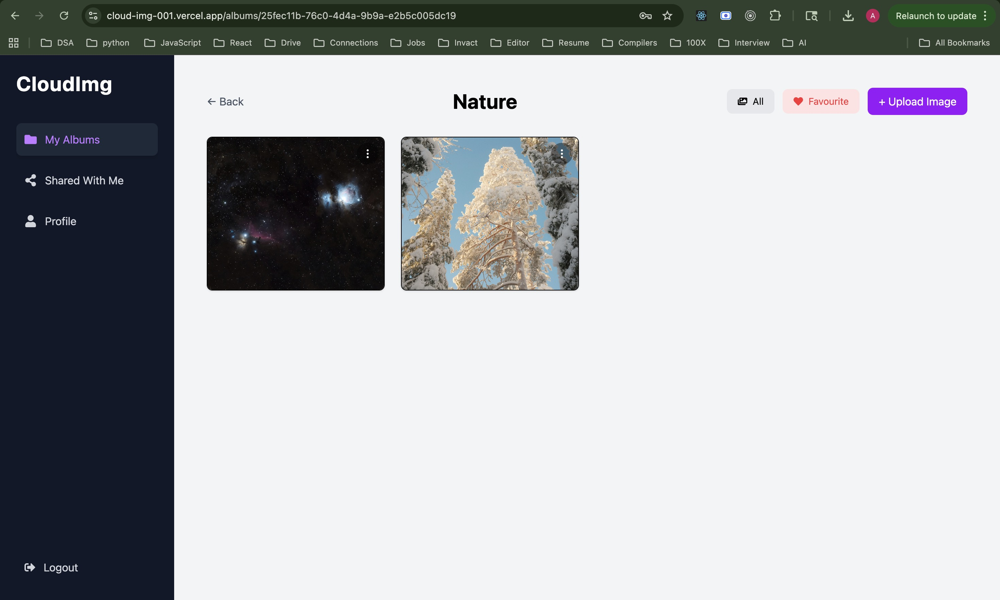

# 🚀 CloudImg – Cloud-Based Image Management Platform

A full-stack cloud-based image management platform where users can securely upload, organize, manage, and share images through albums.

Built using React, Node.js, Express, MongoDB, Cloudinary, JWT Authentication, and Google OAuth.

---

## 🌐 Live Demo

🔗 https://cloud-img-001.vercel.app

---

## 🔑 Demo Login

> **Guest Account**
>
> Email: `guest@example.com`
>
> Password: `guest123`


---

## ⚡ Quick Start

```bash
git clone https://github.com/Abdul-Kalam0/CloudImg.git

cd CloudImg

# Install Backend Dependencies
cd backend
npm install

# Install Frontend Dependencies
cd ../frontend
npm install
```

Run Backend:

```bash
cd backend
npm run dev
```

Run Frontend:

```bash
cd frontend
npm run dev
```

---

## 🛠️ Technologies

### Frontend

* React (Vite)
* Tailwind CSS
* React Router DOM
* Axios
* React Toastify

### Backend

* Node.js
* Express.js
* MongoDB
* Mongoose

### Authentication

* JWT Authentication
* HTTP-only Cookies
* Google OAuth

### Cloud Services

* Cloudinary

### Deployment

* Vercel

---

## 🎥 Demo Video

Watch a complete walkthrough of the application:

[Demo Video Link](#)

---

## ✨ Features

### Authentication

* User Registration & Login
* Google OAuth Login
* JWT Authentication
* Secure HTTP-only Cookie Storage
* Protected Routes

### Album Management

* Create Albums
* Edit Album Details
* Delete Albums
* View Shared Albums

### Image Management

* Upload Images
* Organize Images by Album
* Delete Images
* Favorite Images
* Optimized Cloud Storage

### Collaboration

* Share Albums with Other Users
* Comment on Images
* Access Shared Content

### User Experience

* Fully Responsive Design
* Modern SaaS-Inspired UI
* Toast Notifications
* Protected Navigation

---

## 📸 Screenshots

### Login Page



### Albums Dashboard


### Shared Albums



### Image Gallery



### Image View


---

## 📡 API Reference

### Authentication

#### POST `/auth/register`

Register a new user.

**Response**

```json
{
  "user": {},
  "token": "jwt_token"
}
```

---

#### POST `/auth/login`

Login user.

**Response**

```json
{
  "user": {},
  "token": "jwt_token"
}
```

---

#### GET `/auth/me`

Get authenticated user details.

**Response**

```json
{
  "user": {}
}
```

---

### Albums

#### POST `/albums`

Create a new album.

**Response**

```json
{
  "_id": "albumId",
  "title": "Travel Photos"
}
```

---

#### GET `/albums`

Get all albums.

**Response**

```json
[
  {
    "_id": "albumId",
    "title": "Travel Photos"
  }
]
```

---

### Images

#### POST `/albums/:id/images`

Upload image to album.

**Response**

```json
{
  "_id": "imageId",
  "url": "cloudinary_url"
}
```

---

## 📁 Folder Structure

```text
CloudImg
│
├── frontend
│   ├── src
│   ├── components
│   ├── pages
│   ├── context
│   ├── services
│   └── routes
│
├── backend
│   ├── controllers
│   ├── middleware
│   ├── models
│   ├── routes
│   └── utils
│
└── README.md
```

---

## 🔐 Security

* JWT Authentication
* HTTP-only Cookies
* Protected Backend APIs
* Secure Route Authorization
* Album Access Control
* Google OAuth Verification

---

## 📊 Project Highlights

* Full-Stack MERN Application
* Cloudinary Integration
* Album Sharing System
* Image Favorites & Comments
* Secure Authentication
* Production-Ready Architecture
* Responsive SaaS UI
* Cross-Origin Cookie Handling

---

## 🚧 Future Improvements

* Drag & Drop Uploads
* AI-Based Image Tagging
* Image Compression
* Real-Time Collaboration
* AWS S3 Support
* Dark Mode

---

## 📧 Contact

For bugs, suggestions, or collaboration opportunities:

**Abdul Kalam**

GitHub: https://github.com/Abdul-Kalam0

LinkedIn: https://www.linkedin.com/in/your-profile

Email: [your-email@example.com](mailto:your-email@example.com)

---

## ⭐ Support

If you found this project useful:

⭐ Star this repository

🍴 Fork and contribute

📢 Share it with others
