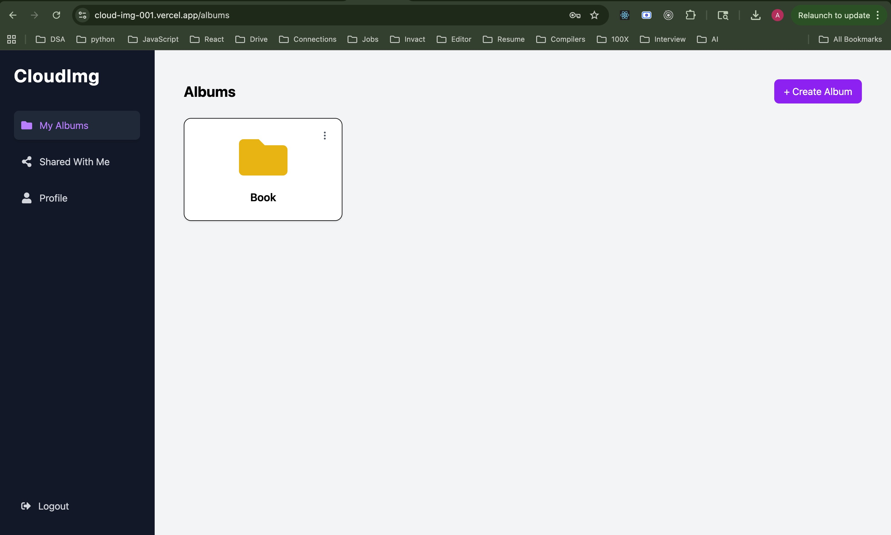
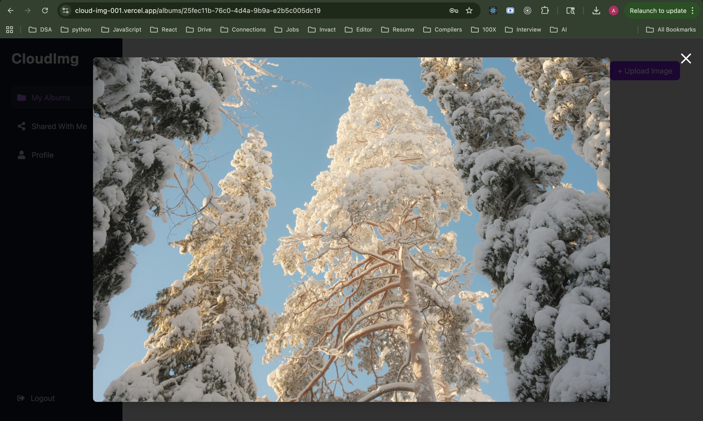

# 🚀 CloudImg – Cloud-Based Image Management Platform

CloudImg is a full-stack cloud-based image management platform that allows users to securely upload, organize, manage, and share images using a modern scalable architecture.

---

## 🌐 Live Demo

🔗 https://cloud-img-001.vercel.app

---

## 📌 Features

- 🔐 Authentication (JWT + Google OAuth)
- 🍪 Secure HTTP-only Cookie Authentication
- 📂 Create and manage albums
- 🖼️ Upload and organize images
- ⭐ Mark images as favorites
- 💬 Comment on images
- 🤝 Share albums with other users
- 📱 Fully Responsive UI
- 🎨 Modern SaaS-style Interface
- 🔒 Protected Routes & API Security
- ☁️ Cloudinary-powered image uploads
- 🖼️ Optimized cloud image storage

---

## 🛠️ Tech Stack

### Frontend

- React (Vite)
- Tailwind CSS
- React Router DOM
- Axios
- React Toastify

### Backend

- Node.js
- Express.js
- MongoDB (Mongoose)

### Authentication

- JWT (HTTP-only cookies)
- Google OAuth

### Deployment

- Frontend: Vercel
- Backend: Vercel

### Images

- Cloudinary

---

## 📸 Screenshots

### Login


---

### Dashboard



---

### Album Page


---

### Image Gallery


### Images

 (./screenshots/Image1.jpg)

---

## 📁 Folder Structure

```bash id="kr93dz"
CloudImg/
│
├── frontend/
│   ├── src/
│   ├── components/
│   ├── context/
│   ├── pages/
│   ├── routes/
│   ├── services/
│
├── backend/
│   ├── controllers/
│   ├── middleware/
│   ├── models/
│   ├── routes/
│   ├── utils/
│
└── README.md
```

---

## ⚙️ Installation & Setup

### 1️⃣ Clone the repository

```bash id="zv18dc"
git clone https://github.com/Abdul-Kalam0/CloudImg

cd CloudImg
```

---

### 2️⃣ Setup Backend

```bash id="9m5c7q"
cd backend

npm install
```

Create `.env` file:

```env id="2g7m4x"
PORT=3000

MONGO_URI=your_mongodb_uri

JWT_SECRET=your_secret

GOOGLE_CLIENT_ID=your_google_client_id
```

Run backend:

```bash id="pk91va"
npm run dev
```

---

### 3️⃣ Setup Frontend

```bash id="d7f1sb"
cd frontend

npm install
```

Create `.env` file:

```env id="v8n2qp"
VITE_API_URL=http://localhost:3000

VITE_GOOGLE_CLIENT_ID=your_google_client_id
```

Run frontend:

```bash id="a5y3tc"
npm run dev
```

---

## 🔐 Authentication Flow

### Email/Password Login

- User logs in → JWT token stored in HTTP-only cookies
- Protected routes validated using `/auth/me`

### Google OAuth

- User logs in using Google
- Backend verifies Google credential
- JWT cookie is issued after verification

---

## 📡 API Endpoints (Sample)

```bash id="j1s8mo"
POST   /auth/register
POST   /auth/login
POST   /auth/google
POST   /auth/logout
GET    /auth/me

POST   /albums
GET    /albums
PUT    /albums/:id
DELETE /albums/:id

POST   /albums/:id/images
DELETE /albums/:id/images/:imageId

POST   /albums/:id/share
POST   /albums/:id/comments
```

---

## 🏗️ Architecture & Security

- 🏗️ Scalable MERN architecture
- 🍪 Cross-origin secure cookie authentication
- 🛡️ Protected backend APIs using JWT middleware
- 🔒 Secure album & image access control
- ⚡ Optimized frontend routing with protected/public routes

---

## 📊 Project Highlights

- ⚡ Built multiple REST APIs
- 🖼️ Cloud-based image organization system
- 🔐 Secure authentication using JWT + OAuth
- 🤝 Album sharing & collaboration features
- ⭐ Favorites & comments functionality
- 🎨 Production-grade SaaS-inspired UI/UX
- 🚀 Deployed with cross-origin cookie handling

---

## 🧠 Learnings

- Full-stack MERN architecture
- Authentication & authorization
- Cross-origin cookie handling
- File & image management workflows
- REST API design
- State management & protected routing
- Modern UI/UX design with Tailwind CSS
- Deployment & production environment handling

---

## 🚧 Future Improvements

- 🖼️ Image compression & optimization
- 📦 Drag & drop uploads
- 🤝 Real-time collaboration
- 🧠 AI-based image tagging
- 🌙 Dark mode support
- ☁️ Cloudinary/AWS S3 integration

---

## ⭐ Show Your Support

If you found this project useful:

👉 Star ⭐ this repository
